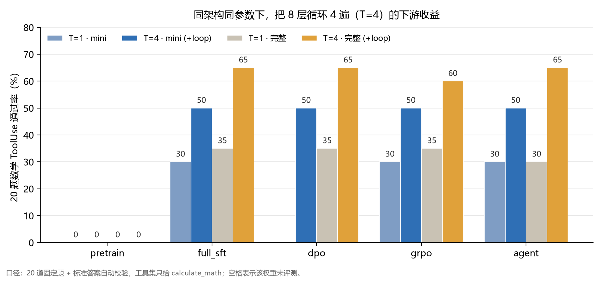
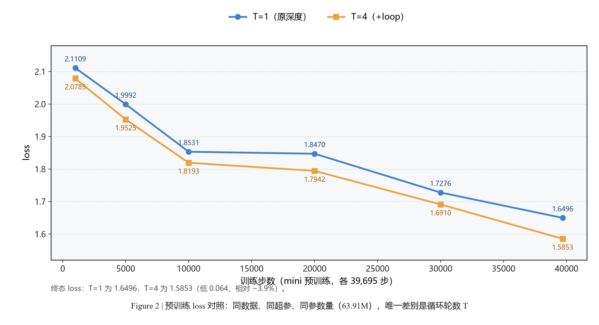
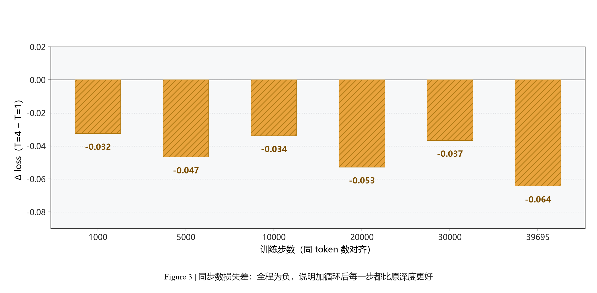
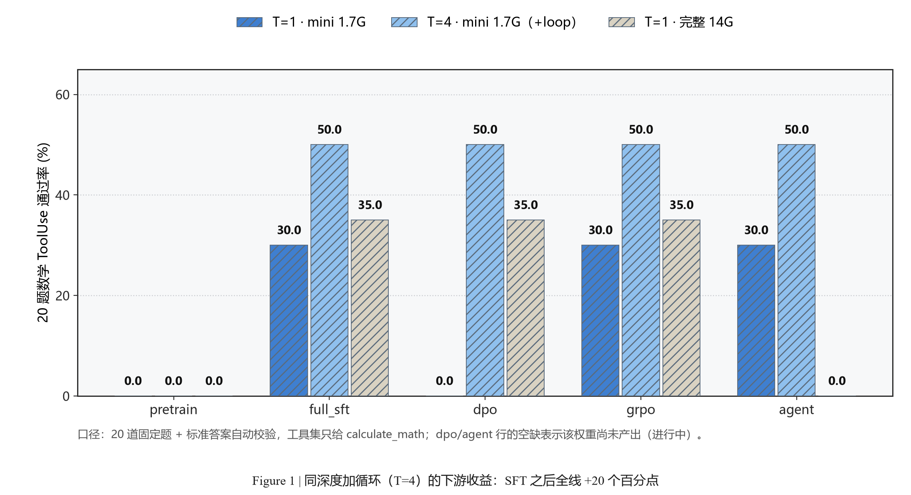
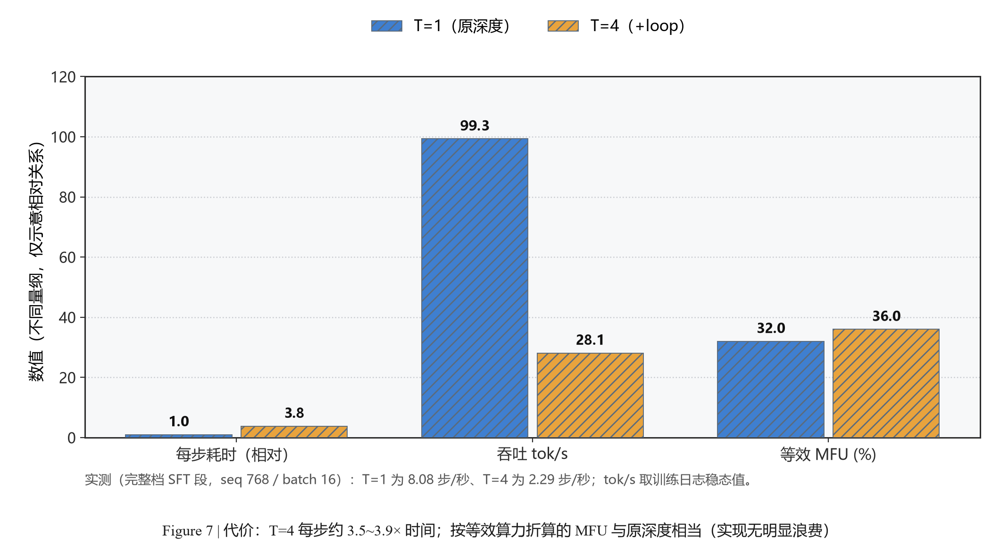
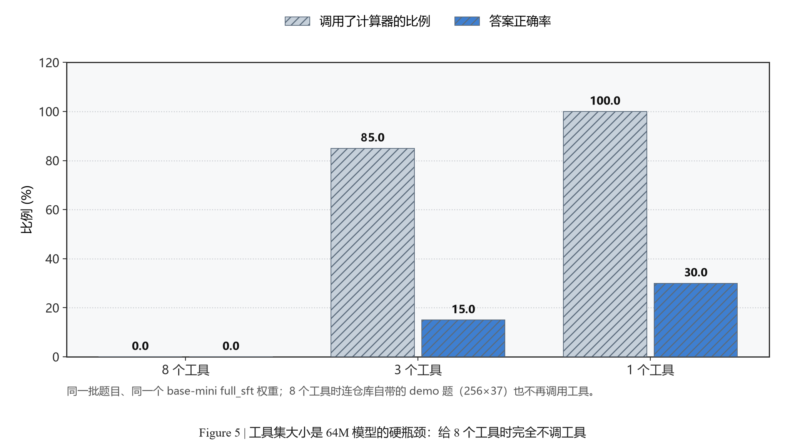
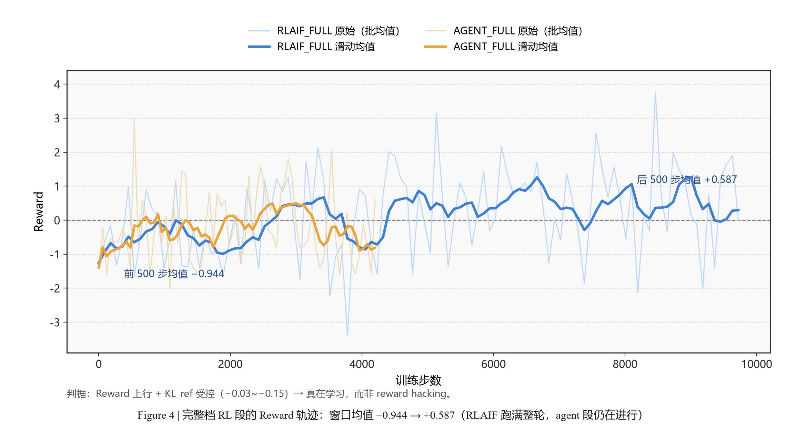

<div align="center">

<h1>loopllm</h1>

<h3>把 MiniMind 的 8 层循环 4 遍：一次严格 A/B 的「循环 Transformer」复现</h3>

[](LICENSE)
[](requirements.txt)
[](https://github.com/jingyaogong/minimind)
[](https://github.com/ruyishu/loopllm/pulls)

**同架构、同参数、同数据、同超参 —— 唯一变量是「同一组层跑几遍」**

</div>

---

## 📌 这是一件什么事

2025–2026 年，「循环 Transformer / 递归深度（recurrent depth）」是绕不开的话题：OpenAI Astra 采用 recurrent depth 做潜空间推理的传闻、字节 **Ouro-1.4B**、**LoopFormer**（ICLR 2026）、**Fully Looped Transformer**……

但主流工作的口径基本都是「**砍深度、加循环**」——把 24 层砍成 6 层再循环 4 遍，然后说「1.4B ≈ 3~4B」。这条口径回答的是「怎么用更少参数拿到同等效果」。

这个仓库问一个更朴素的问题：

> **深度不动，只把同一组层多跑几遍，多花的那份算力买到性能了吗？**

做法是拿 [MiniMind](https://github.com/jingyaogong/minimind)（教学级 64M 全流程仓库，预训练 → SFT → DPO → RLAIF → Agentic RL → 评测）当基座，**只改约 30 行**加上 `n_loops`，跑一组严格 A/B：

| | T=1（原版 MiniMind） | T=4（loopllm） |
|---|---|---|
| 架构 | 8 层 / d768 / GQA 8Q-4KV | **完全相同** |
| 参数量 | 63.91M | **63.91M（权重共享，0 新增参数）** |
| 数据 / 超参 / 硬件 | mini 或完整档，仓库默认超参 | **完全相同**（完整档数据 md5 一致） |

---

## 🎯 结论先行

> ✅ **原深度 + 循环（T=4）确实涨点，而且多个独立信号方向一致**

| 维度 | T=1 | T=4 | 变化 |
|---|---|---|---|
| 预训练终态 loss（mini 档，同步数 39,695） | 1.6496 | **1.5853** | **−0.064（−3.9%），且全程每一步都更低** |
| 预训练终态 loss（**完整档**，264,651 步） | 1.6433 | **1.5898** | **−3.3%** |
| SFT 终态 loss（**完整档**，319,340 步） | 1.4955 | **1.3895** | **−7.1%** |
| 20 题数学工具调用（mini 档权重） | 6/20（30%） | **10/20（50%）** | **+20 个百分点，稳定** |
| 20 题数学工具调用（**完整档**权重） | 7/20（35%） | **13/20（65%）** | **+30 个百分点；SFT / DPO / Agent 均 13/20，GRPO 12/20** |
| 对标官方原版 MiniMind 权重 | 7/20（35%） | **13/20（65%）** | **完整档明显超过官方全量权重（9/20），也超过官方最好档 11/20 的表达式正确率** |
| 代价 | — | 每步 **3.5~3.9×** 时间 | 参数量不变、**不省显存** |

<div align="center">



</div>

---

## 🔧 改了什么：30 行，一个开关

改动集中在 `model/model_minimind.py`（`MiniMindModel.forward`），三个设计点都为了「循环不要破坏原模型行为」：

```python
# 1) 每轮一个残差系数（LayerScale 风格）：1/√T 让 T 轮的残差和不随 T 膨胀
self.n_loops = int(getattr(config, "n_loops", 1) or 1)
self.loop_gates = nn.Parameter(torch.full((self.n_loops,), 1.0 / math.sqrt(self.n_loops))) \
    if self.n_loops > 1 else None

# 2) 输入注入：第 r>0 轮把首轮嵌入再加一遍，防止多轮后表示逐轮漂移
injected = hidden_states
for r in range(self.n_loops):
    h = hidden_states + injected if r > 0 else hidden_states
    for layer, past_key_value in zip(self.layers, past_key_values):
        h, present = layer(h, position_embeddings, ...)
    hidden_states = hidden_states + self.loop_gates[r] * (h - hidden_states)
```

- **T=1 时行为与上游 MiniMind 完全一致**（走 `else` 分支，`loop_gates` 为 `None`）
- **循环时自动关闭 KV cache**：单槽 KV 表达不了多轮，`n_loops > 1` 直接 `use_cache = False` —— 也正因为这个，**loop 并不省显存**
- 所有 trainer / 评测脚本统一加 `--n_loops`（默认 1，不影响原流程）：
  `trainer/{train_pretrain,train_full_sft,train_dpo,train_grpo,train_agent}.py`、`eval_llm.py`、`scripts/eval_toolcall.py`

---

## 📊 实验结果

### 1. 预训练：同数据、同步数、同参数量

| 步数 | T=1 | T=4 | 差值（T=4 − T=1） |
|---|---|---|---|
| 1,000 | 2.1109 | 2.0785 | −0.032 |
| 5,000 | 1.9992 | 1.9525 | −0.047 |
| 10,000 | 1.8531 | 1.8193 | −0.034 |
| 20,000 | 1.8470 | 1.7942 | −0.053 |
| 30,000 | 1.7276 | 1.6910 | −0.037 |
| **39,695（终态）** | **1.6496** | **1.5853** | **−0.064（−3.9%）** |

差值**全程为负**：不是某一段的偶然优势。

<div align="center">




</div>

### 2. 下游能力：20 题数学 ToolUse（自建评测，自动判分）

| 权重 | T=1 · mini 数据 | **T=4 · mini 数据** | T=1 · 完整数据 | **T=4 · 完整数据** |
|---|---|---|---|---|
| pretrain | 0/20 (0%) | 0/20 (0%) | 0/20 (0%) | 0/20 (0%) |
| full_sft | 6/20 (30%) | **10/20 (50%)** | 7/20 (35%) | **13/20 (65%)** |
| dpo | — | 10/20 (50%) | 7/20 (35%) | **13/20 (65%)** |
| grpo | 6/20 (30%) | 10/20 (50%) | 7/20 (35%) | **12/20 (60%)** |
| agent | 6/20 (30%) | 10/20 (50%) | 6/20 (30%) | **13/20 (65%)** |

（`dpo` 行的 `—` 表示该权重当时未评测；`math_plus` 工具集口径下趋势一致，绝对值整体下移，完整档为 T=1 6/6/7/8 → T=4 **10/10/10/11**。）

三点值得注意：

1. **完整档 SFT / DPO / Agent 均为 +30pp（7/20 → 13/20），GRPO 为 +25pp（7/20 → 12/20）**，mini 档 SFT 之后三段全部 +20pp，与 loss 优势方向一致 —— 两个独立指标互相印证
2. 差距来源是**表达式正确率**：完整档 SFT/DPO/Agent 8/20 → 14/20（GRPO 8/20 → 13/20），mini 档 7/20 → 11/20；两边「愿不愿意调工具」都是 20/20 —— 循环模型学会了**更准确地构造算式**，而不只是更愿意调工具
3. **T=4 只用 1/8 数据**（mini 1.7G SFT）就超过了 T=1 用完整数据（14G）的成绩；而两边都用完整档时，差距扩大到 5~7 题

<div align="center">



</div>

### 3. 对标官方原版权重（同题目、同口径、`n_loops=1`）

这一组对照回答了一个关键质疑：「是不是你们把小模型训废了？」

| 权重 | 答对 | 调工具 | 表达式正确 |
|---|---|---|---|
| 官方 `agent` | 9/20 (45%) | 20/20 | 11/20 (55%) |
| 官方 `full_sft` | 9/20 (45%) | 17/20 | 10/20 (50%) |
| 官方 `pretrain` | 0/20 (0%) | 0/20 | 0/20 |
| 本仓库 T=1 完整档 `agent` | 6/20 (30%) | 20/20 | 8/20 (40%) |
| 本仓库 T=1 完整档 `full_sft` | 7/20 (35%) | 18/20 | 8/20 (40%) |
| **本仓库 T=4（mini 数据）`full_sft`** | **10/20 (50%)** | 20/20 | **11/20 (55%)** |
| **本仓库 T=4（完整档）`full_sft`** | **13/20 (65%)** | 20/20 | **14/20 (70%)** |
| **本仓库 T=4（完整档）`agent`** | **13/20 (65%)** | 20/20 | **14/20 (70%)** |

- **官方原版权重在同一套评测上也只有 45%** ⇒ 原版 64M 的参照点就摆在那里，**T=4 完整档把它拉开到 65%**
- 知识类榜单项上我们与官方**逐项对齐**（GSM8K 同 300 题都是 4/300），知识型基准上双方都贴地板 ⇒ 说明这代规模测不出知识能力，档位差异只能靠工具调用这类任务分辨
- **T=4 用 1/8 数据追平官方全量权重；用完整档则明显超过** —— 这是「拿算力换性能」最直接的两条证据

### 4. 代价：T=4 到底贵多少

| 指标 | T=1 | T=4 | 倍数 |
|---|---|---|---|
| 参数量 | 63.91M | 63.91M | 1.00× |
| 步速（完整档 SFT，seq 768 / batch 16） | 8.08 步/秒 | 2.29 步/秒 | 3.5× |
| 吞吐 tok/s（训练稳态） | 99,262 | 28,092 | 3.5× |
| 等效 MFU（按 4 遍层折算） | 32.0% | ≈36% | 相当 |

**跑 4 遍层只慢 3.5 倍**（而不是 4~5 倍）⇒ 循环实现本身没有明显浪费；但它**不省显存**（必须关 KV cache）。

<div align="center">



</div>

### 5. 一个容易被忽略的副发现：**工具集大小是 64M 模型的硬瓶颈**

同一个权重、同一批题，只改变**暴露给模型的工具数量**：

| 工具集 | 会调用计算器的比例 | 答案正确率 |
|---|---|---|
| 8 个（仓库全部工具） | 0 / 3 | 0% |
| 3 个 | 16~17 / 20 | 10~15% |
| 1 个（只给计算器） | 20 / 20 | 30% |

> 连仓库自带的 demo 题「256 乘以 37」，在给 8 个工具时模型也**完全不调用工具**。
> 所以**任何工具调用分数都必须标注工具集大小**，否则数字不可比 —— 上游 README 里的「60% → 85%」就没有标注这一点。
> 本仓库所有分数默认 `math_only`（只给计算器）口径，评测脚本支持 `--tool_mode math_only|math_plus|all` 三档。

<div align="center">



</div>

### 6. RL 段：完整档不限时 RL 确实在学，mini 档的「RL 没提升」是预算假象

| RL 段 | 前 500 步 Reward 均值 | 后 500 步 Reward 均值 | 步数（均已跑满） |
|---|---|---|---|
| T=1 · RLAIF | −0.944 | **+0.587** | 9,751 / 9,751 |
| T=1 · Agentic RL | −0.343 | **+0.517** | 19,994 / 19,994 |
| T=4 · RLAIF（超参 b1g2） | −0.922 | −0.247 | 19,502 / 19,502 |
| T=4 · Agentic RL（超参 b1g2） | +0.163（前 100 步） | **+0.291**（近 100 步 **+0.471**） | 39,988 / 39,988 |

两条链路的四段 RL 现在都跑满了各自的预算，`KL_ref` / `KL` 稳定在 −0.03 ~ −0.15、`gnorm` 稳定 ⇒ **没有 reward hacking**。

> 📌 **T=4 的 Agentic RL 在跑满预算后，Reward 末窗升到 +0.29（近 100 步 +0.47），与 T=1 的 +0.52 属同一量级**；但 **T=4 的 RLAIF 没有出现 T=1 那种 −0.94 → +0.59 的爬升，末窗停在 −0.25**。结合上面「GRPO 档位下游只 +25pp、而 Agent 档 +30pp」，一个合理的读法是：**循环模型在 RLAIF(GRPO) 这一段的优化效率更低，而在 Agentic RL 段能够补回来** —— 但这只是两条链路各一次的观察，不足以下强结论。
>
> ⚠️ 注意 mini 档的 RL：两段各只给了 45 分钟预算，实测 45 分钟只能跑完 **6%（RLAIF）/ 2%（AGENT）** 的一个 epoch —— 所以 mini 上「RL 没有提升」是**预算不足的假象**，不是 RL 无效。

<div align="center">



</div>

---

## 🚀 快速开始

### 0. 环境

```bash
git clone https://github.com/ruyishu/loopllm.git
cd loopllm
pip install -r requirements.txt
# 需要 torch（建议 2.6+，单卡 48G 即可跑完整档；mini 档 24G 卡也够）
```

### 1. 数据

沿用 MiniMind 的数据集与编码方式，把下载好的 `*.jsonl` 放到 `dataset/` 下（见 [`dataset/dataset.md`](dataset/dataset.md)）。
本项目未改动数据格式，**T=1 与 T=4 用的必须是同一份数据**（这是实验成立的前提）。

### 2. 训练：T=1 与 T=4 只差一个参数

```bash
# ---------- 预训练 ----------
# T=1（原版 MiniMind 行为）
python trainer/train_pretrain.py --data_path ../dataset/pretrain_t2t_mini.jsonl \
    --n_loops 1 --max_seq_len 340 --epochs 2 --save_weight t1_pretrain

# T=4（循环 4 遍，权重共享）
python trainer/train_pretrain.py --data_path ../dataset/pretrain_t2t_mini.jsonl \
    --n_loops 4 --max_seq_len 340 --epochs 2 --save_weight t4_pretrain

# ---------- SFT（n_loops 必须与预训练一致）----------
python trainer/train_full_sft.py --n_loops 4 --from_weight t4_pretrain --save_weight t4_sft
# ---------- DPO / RLAIF(GRPO) / Agentic RL ----------
python trainer/train_dpo.py --n_loops 4 --from_weight t4_sft --save_weight t4_dpo
python trainer/train_grpo.py --n_loops 4 --from_weight t4_dpo --loss_type cispo --save_weight t4_grpo
python trainer/train_agent.py --n_loops 4 --from_weight t4_grpo --save_weight t4_agent
```

> 记得给长任务带上 `PYTORCH_CUDA_ALLOC_CONF=expandable_segments:True`（见下方踩坑表，这一条没带会随机 OOM）。

### 3. 评测（自建 20 题数学 ToolUse，自动判分）

```bash
# 默认 math_only 口径（只给计算器）；也可 math_plus / all
python scripts/eval_math_toolcall.py --n_loops 4 --weight t4_sft --tool_mode math_only
```

- 20 道**必须借助计算器才算得准**的数学题，题目与标准答案内嵌在脚本里（`MATH_TASKS`），判分走仓库的 `safe_math_eval`
- 输出三档指标：**调工具率 / 表达式正确率 / 最终答案正确率**
- 复现技术报告里的全部图表：

```bash
python scripts/make_report_figs.py     # 生成 figures/*.png（数值为实测值，内嵌在脚本里）
```

---

## 📁 目录结构

```
loopllm/
├── model/model_minimind.py     # ★ 唯一架构改动点（n_loops / loop_gates / 输入注入）
├── trainer/                    # 预训练 / SFT / DPO / RLAIF(GRPO) / Agentic RL（均支持 --n_loops）
├── scripts/
│   ├── eval_math_toolcall.py   # ★ 20 题数学 ToolUse 自动判分（本次实验的主要下游指标）
│   ├── make_report_figs.py     # ★ 技术报告 7 张图的生成脚本
│   └── eval_toolcall.py        # 上游自带的工具调用 demo（不打分）
├── dataset/                    # 数据准备脚本与说明（数据文件需自行下载）
├── figures/                    # 技术报告图表（fig1~fig7 为 mini 档报告，fig8 为完整档四臂对照）
├── docs/
│   ├── 技术报告.md              # 完整实验报告（含图表、工程记录、局限）
│   └── Looped-Transformer-拆解.md  # 背景调研：传闻、机制、论文时间线
├── LICENSE                     # Apache-2.0（沿用上游）
└── requirements.txt
```

---

## 🩹 复现踩坑记录（长任务复现，一半时间花在这里）

| 事故 | 症状 | 根因 | 修复与固化 |
|---|---|---|---|
| **CRLF 卡死**（最坑） | 链路进程「活着」但 11 小时不推进 | 脚本被写入 `\r\n`，bash 把 `sleep 60\r` 解析失败后进入死循环 | 源头改 LF + 部署后校验 `CR=0`；**监控口径从「看进程存活」改为「看阶段标记推进」** |
| **T=4 RL 段 OOM** | RLAIF / AGENT 秒退 | 默认配置跑 4 遍层单独就 >44.5G；改小后与预训练**同卡**又爆 | `batch 1 × num_generations 2` + `expandable_segments`；**RL 必须在 GPU 空闲时跑** |
| **tok/s 指标失真** | 日志里 tok/s 从 21,000 掉到 288 | checkpoint 存盘耗时落在同一日志区间 | 判据改为**步数推进速度**，tok/s 只看趋势 |
| **评测脚本要 stdin** | `EOFError`，评测段退出 | `eval_toolcall.py` 里有 `input()` | 链路里统一 `echo 0 \|` 喂入 |
| **reward model 分片缺失** | RL 阶段秒失败 `FileNotFoundError` | 下载中断留下 .incomplete 分片 | 补下分片 + md5 校验后重跑该段 |
| **「重复训练」虚警** | 出现 9 个 `train_full_sft.py` 进程 | 主进程 + 8 个 DataLoader worker 共享同一命令行 | 用 `ps -o pid,ppid` 核实父子关系判定 |
| **奖励函数崩掉整段训练**（两个位置） | ① Agentic RL 第 2,412 步 `AttributeError`；② 第 34,087 步又崩在同族问题上 | ① `calculate_rewards` 里工具参数校验假定 `arguments` 是 dict，模型发出 **float** 时 `.get()` 抛异常；② `rollout_single` 里假定整条工具调用是 dict，模型发出 **list** 时同样抛异常 | 两处都改为「非 dict 一律兜成 `{}`」（按「参数不合法 / 工具不存在」处理）而不是让它杀掉训练；**两条臂同改同一处**，改动前先备份 |
| **「有权重文件=成功」的误判** | 救援脚本把崩溃 / 超时截断的一轮当成「已完成」，跳过了重试档 | trainer 默认 `save_interval=10`，崩溃前刚存过一次权重，判据 `[ -s xxx.pth ]` 因此为真 | 成功判据改为**读日志**（有无 Traceback、退出码是否 0/124），不看权重文件是否存在 |

---

## ⚠️ 局限（必须一起读）

- **规模局限**：结论建立在 **64M 模型**上，未验证能否外推到更大模型与更长训练
- **评测局限**：下游只有 **20 道题的单一任务**（数学工具调用），且该任务对工具集大小极其敏感（8 工具时归零）；n=20 的分辨率有限（SE 偏大，个别档位差异可能在噪声内）
- **RL 段超参对不齐（预算已对齐）**：① 两侧的 RL 预算是**等数据覆盖**的（T=1 用 `batch 2 / num_generations 4` 跑 9,751 / 19,994 步，T=4 用 `batch 1 / num_generations 2` 跑 19,502 / 39,988 步，样本覆盖等价）；② 但**超参本身对不齐**：把 T=4 的 RL 配到 T=1 的 `batch 2 / num_generations 4` 会**直接 OOM**（44.52 GiB 只剩 234 MiB）—— 这是单卡显存的硬约束，不是实现问题。所以 RL 段是「**等数据、不等超参**」的对照；SFT / DPO 不受影响，是干净的等数据等步数对照
- **RL 的 Reward 证据不对称**：T=4 的 Agentic RL 末窗（+0.29）与 T=1（+0.52）同量级，但 T=4 的 RLAIF 末窗（−0.25）远低于 T=1（+0.59）—— 只看「RL 学得好不好」这一项，两条链路的结论并不一致
- **未做 T 扫描**：只比较了 T=1 与 T=4，**无法回答「最优 T 是多少」**
- **无等算力对照**：本实验刻意不折算等效深度，所以「把 T=4 多花的 3.5× 算力给 T=1 跑更久会怎样」**没有回答**

---

## 🗺️ Roadmap

- [x] **完整档 T1 vs T4 对账**：两条完整档链路的五个档位、以及四段 RL 的完整预算都已横向对齐（见上文表格）；剩余的口径差异只有「RL 超参小一档」
- [ ] **等算力对照**：把 T=4 多花的算力给 T=1 跑更长步数，形成「同 wall-clock」曲线
- [ ] **T 扫描**：T=2 / 4 / 8 的收益曲线与最优 T
- [ ] **规模外推**：同仓库 104M / 198M 档，验证「加 loop 的收益是否随规模保持」
- [ ] **推理侧**：KV 复用（decode 末轮 KV）把循环的推理开销压下来

---

## 🙏 致谢与许可

- 本项目是 **[MiniMind](https://github.com/jingyaogong/minimind)**（Apache-2.0）的衍生作品：**数据格式、全流程训练链路、模型骨架与评测资产都沿用上游**，我们只加了循环执行这一个改动点（见 [`NOTICE`](NOTICE)）。上游的 MoE / LoRA / 蒸馏等能力在 T=1 下完全保留、行为一致。
- 背景与对照工作：Ouro-1.4B（arXiv:2510.25741）、LoopFormer（arXiv:2602.11451）、Fully Looped Transformer（arXiv:2605.18797）、Looped Transformers 稳定性（arXiv:2604.15259）
- 本仓库代码沿用上游 **Apache-2.0** 许可。

<div align="center">

如果这个复现对你的工作有帮助，欢迎点个 ⭐ / 提 Issue 讨论「你希望下一个跑哪种 T 或哪种基座」。

</div>
