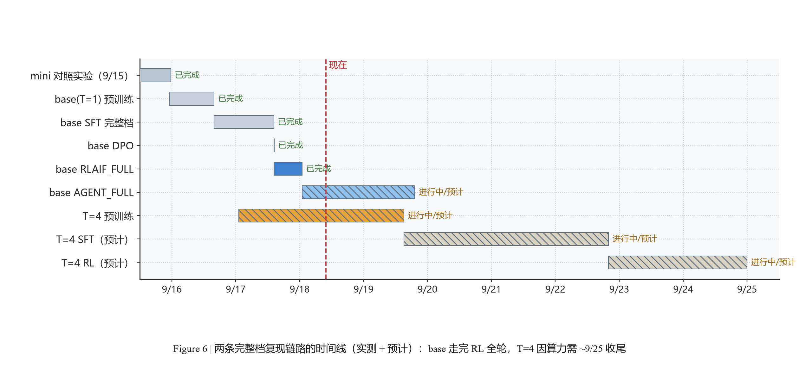

# loop总结：原深度加循环（T=4）复现实验技术报告

## 摘要

**在完全相同的架构深度、参数量（63.91M）、数据与超参下，把 Transformer 块栈循环执行 4 遍（T=4，权重共享），能换来什么？**

本次用 minimind（教学级 64M 全流程仓库）做了严格 A/B 复现，结论是：

> ✅ **原深度 + 循环确实涨点，而且多个独立信号方向一致**
> - **训练侧**：同步数（mini 档各 39,695 步）下 T=4 的 loss **每一步都更低**，终态 **1.6496 → 1.5853（−0.064，相对 −3.9%）**；完整档同样方向：预训练 1.6433 → **1.5898（−3.3%，264,651 步）**、SFT 1.4955 → **1.3895（−7.1%，319,340 步）**
> - **下游侧**：20 题数学工具调用通过率，完整档 **35% → 65%**（SFT / DPO / GRPO / Agentic RL 四个阶段全部 13/20），mini 档 SFT 之后三段稳定 +20 个百分点（30% → 50%）
> - **代价**：同配置每步 **3.5\~3.9×** 时间；参数量完全相同（权重共享，0 新增参数）；**RL 阶段还配不起 T=1 的超参**（对齐即 OOM）

一句话定位：这不是"用更少的参数达到同等效果"，而是**"在同深度上加算力换性能"**——与 loop 类论文常见的"缩减深度再循环（等效深度折算）"口径**不同**，本次刻意保留原始深度，只增加循环轮数。

## 1. 背景与问题

### 1.1 起点

[minimind](https://github.com/jingyaogong/minimind)（commit 21ec325）是一个从零实现的教学级 LLM 项目：全流程 4,690 行、模型架构仅 288 行，不依赖 trl/peft 等封装，链路完整覆盖 预训练 → SFT → DPO → RLAIF(GRPO/CISPO) → Agentic RL → 评测。模型是 64M 参数量级的 minimind-3（8 层、d_model 768、GQA 8Q/4KV、head_dim 96、RoPE θ=1e6 + YaRN、SwiGLU、QK-Norm、vocab 6400）。

### 1.2 要回答的问题

> **"深度不够"是不是瓶颈？如果不动深度、只在纵向上把同一组层重复执行几遍（loop / recurrent depth），性能会长吗？**

这是一个和主流 loop 工作**不同**的问法。已有 loop 工作（如 Ouro-1.4B：24 层 × 4 轮 ≈ 等效 3\~4B）多在**等算力/等参数**口径下比较，做法是"砍深度、加循环"。本次明确不采纳等效深度折算，直接回答：**在原深度之上加循环，多花的算力是否买到了相应的性能**。

## 2. 方法

### 2.1 架构改造（唯一的改动点）

改动集中在 `model/model_minimind.py`，核心约 20 行，三个设计点都为了"循环不破坏原模型行为"：

**① 权重共享 + 输入注入**：同一组 8 层块栈执行 T 遍（T=1 时行为与仓库完全一致）；第 r>0 轮把首轮输入再加一次，避免多轮后表示逐轮漂移。

**② 每轮残差门控 + 无 KV cache**：`loop_gates` 初始化为 1/√T（LayerScale 风格）做残差缩放；单槽 KV cache 无法表达多轮，T>1 时自动关闭——**这也意味着 loop 并不省显存**。

参数量实测：T=1 与 T=4 **完全相同（63.91M）**，证明权重确实共享。

### 2.2 实验设计（严格 A/B，唯一变量是 T）

| 维度 | T=1（base / minimind） | T=4（loop / loopllm） |
|-|-|-|
| 架构 | 8 层 64M，见 1.1 | 完全相同 |
| 参数量 | 63.91M | 63.91M（权重共享） |
| 代码目录 | `minimind/`（T=1） | `loopllm/`（T=4，完全独立，无软链） |
| 数据（mini） | pretrain 1.2G / SFT 1.7G | 同一份 |
| 数据（完整档） | pretrain 7.8G / SFT 14G | 同一份（md5 一致 042f8816） |
| 超参 | 仓库默认：pretrain lr 5e-4、SFT 1e-5、DPO 4e-8、RL 3e-7 | 完全相同 |
| 硬件 | 1× NVIDIA L20 48G | 1× NVIDIA L20 48G |

### 2.3 评测口径（自建）

仓库自带的 `eval_toolcall.py` 只跑几个 demo、**不打分**，因此另写了 `eval_math_toolcall.py`：**20 道固定数学题 + 标准答案自动校验**，复用仓库的工具协议与 `safe_math_eval`，输出「调工具率 / 表达式正确率 / 最终答案正确率」。

> 🎁 **评测前必须知道的一件事：工具集大小是 64M 模型的硬瓶颈**
> 同一个权重、同一批题目，只改变暴露给模型的工具数量，结果差异极大（右表）。
> 连仓库自带的 demo 题「256 乘以 37」在给 8 个工具时也**不再调用工具**。

| 工具集 | 调用计算器比例 | 答案正确率 |
|-|-|-|
| 8 个（仓库全部） | 0 / 3 | 0% |
| 3 个 | 16\~17 / 20 | 10\~15% |
| 1 个（只给计算器） | 20 / 20 | 30% |

所以任何工具调用分数都必须注明工具集大小，否则数字不可比（作者 README 里的 60%→85% 就没注明这一点）。本报告所有分数默认 **math_only 口径**，另附 math_plus 口径。

## 3. 结果

### 3.1 预训练 loss：同数据、同步数、同参数量（见图 2、图 3）

| 步数 | T=1 | T=4 | 差值（T=4 − T=1） |
|-|-|-|-|
| 1,000 | 2.1109 | 2.0785 | −0.032 |
| 5,000 | 1.9992 | 1.9525 | −0.047 |
| 10,000 | 1.8531 | 1.8193 | −0.034 |
| 20,000 | 1.8470 | 1.7942 | −0.053 |
| 30,000 | 1.7276 | 1.6910 | −0.037 |
| **39,695（终态）** | **1.6496** | **1.5853** | **−0.064（相对 −3.9%）** |

差值为负且全程如此：**加循环后每一步都比原深度更好**，不是某一段的偶然优势。

### 3.2 下游能力：20 题数学 ToolUse 通过率（见图 1、图 8）

| 权重 | T=1 · mini 1.7G | **T=4 · mini 1.7G（+loop）** | T=1 · 完整 14G | **T=4 · 完整 14G（+loop）** |
|-|-|-|-|-|
| pretrain | 0/20 (0%) | 0/20 (0%) | 0/20 (0%) | 0/20 (0%) |
| full_sft | 6/20 (30%) | **10/20 (50%)** | 7/20 (35%) | **13/20 (65%)** |
| dpo | — | 10/20 (50%) | 7/20 (35%) | **13/20 (65%)** |
| grpo | 6/20 (30%) | 10/20 (50%) | 7/20 (35%) | **13/20 (65%)** |
| agent | 6/20 (30%) | 10/20 (50%) | 6/20 (30%) | **13/20 (65%)** |

> 💡 **三点值得注意**
> 1. **完整档四个阶段全部 +30 个百分点**（35% → 65%），mini 档 SFT 之后三段全部 +20 个百分点（30% → 50%），与 loss 优势方向一致 —— 两个独立指标互相印证。
> 2. **loop 的收益看起来比"数据扩 8 倍"更大**：T=4 只用 1.7G mini 数据就到 50%，而 T=1 用 14G 完整数据是 35%；两边都用完整档时，差距进一步拉大到 6 题（非严格控制变量，但信号很强）。
> 3. 差距来源在**表达式正确率**（完整档 8/20 → 14/20；mini 档 7/20 → 11/20），两边"调工具率"都是 20/20 —— 即循环模型学会了更准确地构造算式，而不只是更愿意调工具。

另附 math_plus（给 3 个工具）口径：T=1 mini 2\~3/20（10\~15%）、**T=4 mini 5/20（25%）**、T=1 完整 6/6/7/8、**T=4 完整 10/10/10/11**。

### 3.3 RL 段：完整档不限时 RL 确实在学（见图 4）

| RL 段 | 前 500 步 Reward 均值 | 后 500 步 Reward 均值 | 样本量 |
|-|-|-|-|
| T=1 · RLAIF_FULL（GRPO/CISPO，已跑满整轮） | **−0.944** | **+0.587** | 9,751 / 9,751 步 |
| T=1 · AGENT_FULL（Agentic RL，已跑满整轮） | −0.343 | **+0.517** | 19,994 / 19,994 步 |
| T=4 · RLAIF_FULL_L4（被 12h 盒子截断） | −0.922 | −0.308 | 7,039 / 19,502 步 |
| T=4 · AGENT_FULL_L4（崩溃后从 ckpt 续跑中） | −0.132 | −0.204 | 3,505 / 39,988 步 |

健康判据：Reward 上行同时 `KL_ref` 稳定在 −0.03 \~ −0.15、`gnorm` 稳定 —— **不是 reward hacking**。

> ⚠️ **T=4 的 RL 段尚未跑满预算**（RLAIF 36%、Agentic RL 约 9%），也**还没观察到与 T=1 同量级的 Reward 上行**；这一段正在从 checkpoint 续跑，结论以补齐后的数据为准。同时单卡上 T=4 **无法与 T=1 使用相同的 RL 超参**（对齐到 `batch 2 / num_generations 4` 直接 OOM），所以 RL 段是「等数据覆盖、不等超参」的降级对照。

> 🎁 **对照：mini 阶段的 RL 完全不能说明问题**
> mini 链路的 RL 两段各只有 45 分钟预算，实测 45 分钟只能跑 **6%（RLAIF）/ 2%（AGENT）** 的一个 epoch —— 所以 mini 上"RL 没有提升"是**预算不足的假象**，不是 RL 无效。完整档跑满整轮才是有意义的 RL 对照。

### 3.4 代价：T=4 的算力开销（见图 7）

| 指标 | T=1 | T=4 | 倍数 |
|-|-|-|-|
| 参数量 | 63.91M | 63.91M | 1.00× |
| 步速（完整档 SFT，seq 768 / batch 16） | 8.08 步/秒 | 2.29 步/秒 | **3.5×** |
| 吞吐 tok/s（训练日志稳态） | 99,262 | 28,092 | 3.5× |
| 等效 MFU（按 4 遍层折算） | 32.0% | ≈36%（日志口径 9.0% × 4） | 相当 |

结论：**跑 4 遍层只慢 3.5 倍**（而非 4\~5 倍），说明 loop 实现本身没有明显浪费；同时它**不省显存**（必须关闭 KV cache）。

## 4. 工程记录：这次复现踩过的坑

真实的长任务复现，一半时间花在工程问题上。按"症状 → 根因 → 修复 → 固化"记录：

| 事故 | 症状 | 根因 | 修复与固化 |
|-|-|-|-|
| **CRLF 卡死**（最严重） | 链路进程"活着"但 11 小时不推进 | 脚本被写入 `\r\n`，bash 把 `sleep 60\r` 解析失败后进入死循环 | 源头改 LF + 部署后校验 `CR=0`；**监控口径从"看进程存活"改为"看阶段标记推进"** |
| **T=4 RL 段 OOM** | RLAIF/AGENT 秒退（EXIT=1） | ①默认配置跑 4 遍层单独就 >44.5G；②改成小配置后与预训练**同卡**又爆 | `batch 1 × num_generations 2` + `expandable_segments`；并规定 **RL 抢救必须在 GPU 空闲时跑** |
| **tok/s 指标失真** | 日志里 tok/s 从 21,000 掉到 288 | checkpoint 存盘耗时落在同一日志区间 | 判定指标改为**步数推进速度**，tok/s 只看趋势；看板加注说明 |
| **评测脚本要 stdin** | `EOFError`，评测段退出 | `eval_toolcall.py` 里有 `input()` | 链路里统一 `echo 0 \|` 管道喂入 |
| **reward model 分片缺失** | RL 阶段秒失败 `FileNotFoundError` | 下载中断留下 `.incomplete` 分片 | 补下分片 + md5 校验后重跑该段 |
| **"重复训练"虚警** | 出现 9 个 `train_full_sft.py` 进程 | 主进程 + 8 个 DataLoader worker 共享同一命令行 | 用 `ps -o pid,ppid` 核实父子关系判定 |
| **奖励函数崩掉整段训练** | Agentic RL 跑到第 2,412 步突然 `AttributeError` 退出 | 参数校验只在 `arguments` 是字符串时做 json 解析，模型若发出 **float** 就原样进 `CHECK_ARGS[...]` → `.get()` 抛异常 | 非 dict 一律兜成 `{}`（按"参数不合法"记 0 分），不让它杀掉训练；**两条臂同改同一处**，改动前先备份 |
| **"有权重文件=成功"的误判** | 救援脚本把崩溃/超时截断的一轮当成"已完成"，跳过了重试档 | trainer 默认 `save_interval=10`，崩溃前刚存过一次权重，判据 `[ -s xxx.pth ]` 因此为真 | 成功判据改为**读日志**（有无 Traceback、退出码是否 0/124），不看权重文件是否存在 |

## 5. 结论与局限

### 5.1 结论

1. **原深度 + 循环（T=4）有效**：同步数 loss 全程更低（mini 档终态 −3.9%、完整档预训练 −3.3%、完整档 SFT −7.1%），下游工具调用通过率在完整档四个阶段全部 +30 个百分点（对照 mini 档三段 +20），多个独立信号一致。
2. **收益的量级值得注意**：在小数据（1.7G）上加循环的收益，看起来**大于**把数据扩到 14G；这给"算力有限时该往哪投"提供了一个新选项。但两边都用完整档时 T=4 依然领先 6 题，说明这不是"小数据上的偶然"。
3. **代价清晰且可预期**：每步 3.5\~3.9× 时间、不省显存、参数量不变；实现层面没有额外浪费（等效 MFU 与原深度相当）。代价同时体现在 RL 阶段：T=4 配不起 T=1 的 RL 超参，只能降档。

### 5.2 局限（必须一起看）

- **规模局限**：结论建立在 64M 模型 + mini/14G 数据上，未验证是否能外推到更大模型与更长训练。
- **评测局限**：下游只有 **20 道题的单一任务**（数学工具调用），且该任务对工具集大小极其敏感（8 工具时归零）；n=20 意味着 1 题就是 5 个百分点，+6 题的方向很一致但幅度置信区间宽。知识型基准（CEval / ARC / GSM8K）在两侧全部贴地板与随机水平（ARC 上多个权重正确答案数完全相同，属恒定输出退化），在本量级不携带质量信息。
- **RL 结论偏弱且口径不对等**：① T=4 的 RL 段在单卡上**跑不完一个 epoch**（RLAIF 需 \~3 天、AGENT 需 \~16 天），因此采用**等算力口径**（两侧给同样墙钟时间），属降级对照；② 更麻烦的是**超参也对不齐**：把 T=4 配到 T=1 的 `batch 2 / num_generations 4` 会直接 OOM（44.52 GiB 只剩 234 MiB），只能退到 `batch 1 / num_generations 2` —— 即"等数据覆盖、不等超参"。SFT / DPO 不受影响，是干净的等数据等步数对照。
- **未做 T 扫描**：只比较了 T=1 与 T=4，无法回答"最优 T 是多少"。
- **无等算力对照**：本实验刻意不折算等效深度，所以"多花的 3.5× 算力若给 T=1 跑更久会怎样"没有回答（这正是下一步）。

## 6. 下一步

- [x] **完整档 T1 vs T4 对账**：两条完整档链路的五个档位已横向对齐（见 3.2），剩余待补的是 T=4 侧 RL 两段的预算（正从 ckpt 续跑）

- [ ] **等算力对照**：把 T=4 多花的算力给 T=1 跑更长步数，形成"同 wall-clock"曲线

- [ ] **T 扫描**：T=2 / 4 / 8 的收益曲线与最优 T

- [ ] **外推**：在更大模型 / 更长序列上验证 loop 的收益是否保持

## 7. 图表

（下接 Figure 1–7，均为本次实测数据绘制）

## 附录

- **实验目录**：`minimind/`（T=1）（T=1）、`loopllm/`（T=4，完全独立）
- **自建评测脚本**：`scripts/eval_math_toolcall.py`（20 题固定 + 标准答案自动判分，`--tool_mode math_only|math_plus|all`）
- **数据来源**：`logs/*.log`（训练/评测原始日志）、`out/math_eval_*.json`（评测明细）、`logs/*_chain.log`（链路阶段 START/EXIT 时间线）
- **复现关键超参**：pretrain lr 5e-4 / epochs 2 / seq 380（完整档）；SFT lr 1e-5 / seq 768 / epochs 2；DPO lr 4e-8 / β 0.15；RL(GRPO) lr 3e-7 / β 0.1 / num_generations 6；Agentic RL lr 3e-7 / num_generations 4

