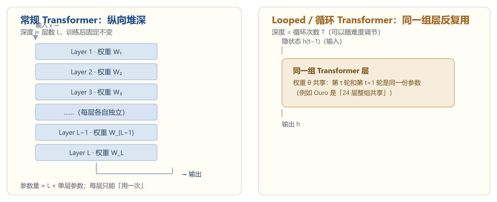
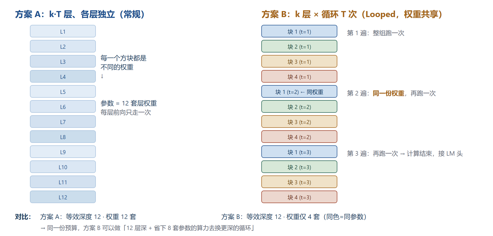
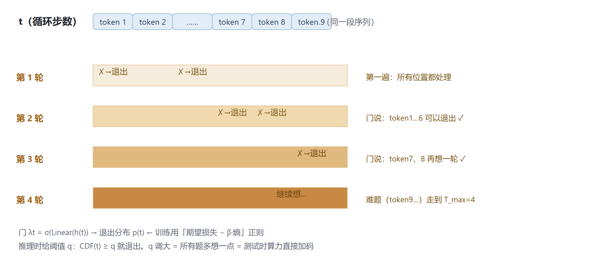
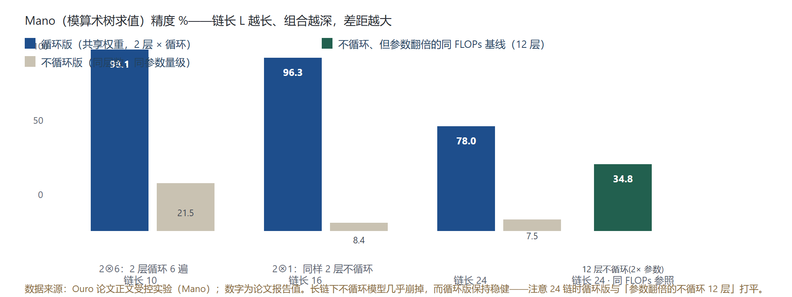
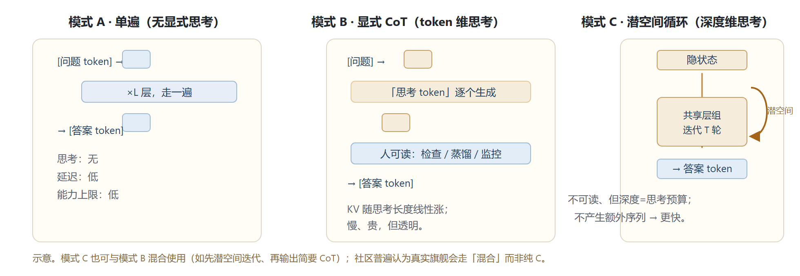
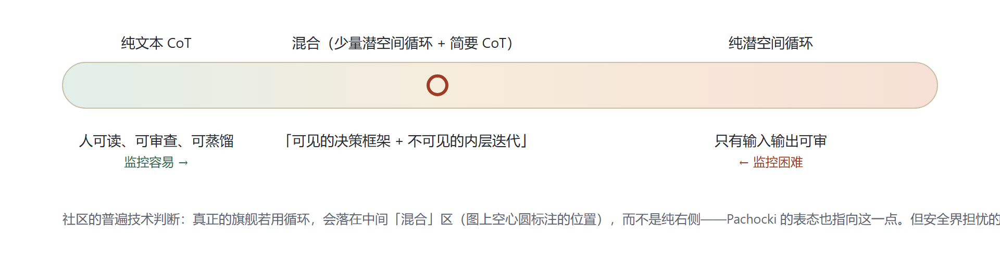

调研日期：2026-09-03 ｜ 主题：OpenAI Astra 的 recurrent depth 传闻、字节 Ouro 与 latent reasoning 的来龙去脉、这项技术的原理与争议

**为什么会有这篇：**今天技术圈在传「OpenAI 下一代模型 Astra 用的是 loop transformer（循环 Transformer / 递归深度）」，同时很多人提到「字节先做出来的」、以及「今年 2 月有人拿它做 latent reasoning 效果贼好」。这篇把这条线从头查到底：它是什么、为什么有效、谁先做的、传闻可信度几何——所有关键结论都标注了证据等级。

**证据分级说明（贯穿全文）：**🟢 已证实 = 论文原文 / 官方仓库 / 官网可查；🟡 媒体报道 = 有来源报道、未经官方证实；🔴 猜测 = 社区讨论 / 推断。Astra 相关结论几乎全部停留在 🟡 或 🔴 档，阅读时请留意。

**30 秒版结论：**

1. **Looped Transformer：**不再堆几十上百个互不相同的层，而是只有一组（几层）Transformer block，把它反复用 T 次——网络「有多深」从层数变成循环次数，深度成了可调的思考预算。
2. 循环 T 次 ≈ 解包成 T 组共享权重的层，等效深度 = 层数 × 循环次数，参数只按层数算。2025 年 2 月 Google 的 Saunshi 等证明：T 次循环能隐式模拟 T 步 CoT——很多需要「深」的问题不需要「大」。
3. 🟢 字节跳动 Seed 团队（与 UCSC、Mila、Princeton 等合作）2025 年 10 月开源 Ouro（arXiv:2510.25741）：首个规模化预训练的循环 LLM（1.4B/2.6B、7.7T tokens、4 步循环 R4），1.4B 打平 4B 常规模型、2.6B 逼近并多项超越 8B 常规模型；核心卖点是把推理搬进预训练、在潜空间迭代。
4. 🟢 2026 年 2 月确实有一批「效果很猛」的工作：RLTT（arXiv:2602.10520）与 LoopFormer（arXiv:2602.11451，已中 ICLR 2026）同一天发布——前者给循环模型的潜空间思维轨迹做奖励、相对 GRPO 平均再涨 5.8%～10.9%，后者让循环深度可弹性伸缩。
5. 🟡 9 月 1 日《The Information》报道 OpenAI 旗舰 Astra 采用 recurrent depth 做潜空间推理，安全圈担忧「看不见的思考」让 CoT 监控失效；9 月 2 日首席科学家 Pachocki 回应：计算图深度「在 GPT-4 的两倍以内」，并重申 CoT 监控仍是核心研究目标。OpenAI 从未证实 Astra 用了循环架构。
6. 一句话：把思考从 token 搬进层，是后 CoT 时代最重要的架构变量之一。循环不是魔法——有清晰理论依据，也有训练不稳定、KV cache 膨胀、深度外推退化等一堆待解问题。

# 1 传闻还原：Astra 到底怎么回事

先把「发生了什么」说清楚。以下内容大量属于媒体报道级，请先读证据分级表再下判断——这是全篇最需要冷静阅读的一节。

**9 月 1 日，《The Information》独家报道。**科技媒体 The Information 报道称，OpenAI 的下一代前沿模型、内部代号 Astra，采用了「递归深度（recurrent depth）」技术，也就是本文主角循环式 Transformer 架构 🟡。报道的核心说法是：Astra 不再只靠「先输出一段人类可读的思维链 token、再给答案」完成推理，而是让隐状态在同一组 Transformer 层里反复循环迭代，把一部分思考放进内部表示（latent space）而非外部文本。

**安全圈立刻反应。**担忧集中在一点：如果模型的思考发生在不可读的数值表示里（有人称其为 neuralese），过去两年建立在「读思维链」之上的安全监控就会失效。据转述，Redwood Research 的 Ryan Greenblatt、评论者 Zvi Mowshowitz 等都公开表达了担忧——外部将更难审计自主智能体的决策，各家实验室若比拼递归深度，可能滑向「不可监控性」的竞赛 🟡。叠加的背景是：OpenAI 自己的安全评估把 Astra 在网络安全方向的能力划到接近 Critical 阈值，今年 8 月初《卫报》还报道过 OpenAI 一度因评估暂停 Astra 相关工作 🟡。「关键能力 + 不可见推理」凑在一起，恐慌被放大。

**9 月 2 日，Pachocki 回应。**OpenAI 首席科学家公开表态（据多家媒体转述）🟡：

> 「包括 Astra 在内的我们当前前沿模型，计算图的深度在 GPT-4 的两倍以内。」他同时表示，外界把循环描述成「无休止、不可控的黑盒递归」是夸大；CoT 监控本身确实脆弱且趋势严峻，但困难来自更深层的对齐动力学而非架构改动，强化监控仍是 OpenAI 的核心研究目标。

**传闻分级表：哪些能当真**

| 说法 | 证据等级 | 说明 |
|-|-|-|
| Astra 是 OpenAI 下一代前沿模型的代号 | 🟡 媒体 | 多家媒体互证，OpenAI 未官宣 |
| Astra 采用 recurrent depth / 循环式架构 | 🟡 媒体 | 源自 The Information 独家报道；OpenAI 不确认也不否认 |
| 潜空间循环推理让 CoT 监控更难 | 🟡 推断 | 技术方向真实存在，但「监控因此失效」是安全界的推断性担忧 |
| 模型计算图深度不超过 GPT-4 的两倍 | 🟡 表态 | Pachocki 公开口径（媒体转述）；注意「计算图深度」不等于「循环带来的等效深度」 |
| 「Astra 是纯循环架构、抛弃 CoT」 | 🔴 猜测 | 多数技术分析认为更可能是「少量循环 + 显式 CoT」的混合；无来源支持「纯潜空间」 |
| 「loop transformer 是字节首先发明的」 | 🔴 不准确 | 概念史早得多；字节的准确贡献是首个大规模开源预训练循环 LLM（见第 5 节） |

**总判断：**「OpenAI 在用某种循环 / 递归深度增强潜空间推理」大概率不空穴来风——从理论（2025-02）、开源实证（Ouro，2025-10）到 2026 年 2 月的强化学习工作，这条路线已非常成熟，且恰好能回答「推理模型的下一个瓶颈是什么」。但所有细节都未经官方证实，请把这一节当情报摘要读，别当官方白皮书读。真正值得深挖的是背后的技术本身，下文展开。

# 2 核心机制：什么是 Looped Transformer

先忘掉传闻，从「一个层一个层地堆」这个最朴素的画面开始。理解了这一步，后面所有论文、争议和传闻都只是它的推论。

## 2.1 常规 Transformer：深度 = 写在架构里的固定常数

一个标准 decoder-only LLM 的前向传播就是一句话：把输入表示依次穿过 L 层互不相同的 Transformer 子层（每层有自己的 attention + MLP 权重）。想让模型更强，通常两条路：堆更多层（参数量上涨），或者让它先输出一大段 CoT token 再作答（把思考外包给显式文本、成本按 token 计）。注意一个关键点：L 是多少，深度就是多少，两者在训练时被焊死。

Looped Transformer 想改变的是第一件事：让深度不再等于层数，而是等于「同一组层被用了多少次」。

（见图 1：把「变深」从「堆更多层」换成「把同一组层循环用」——参数不涨、深度可变。）

## 2.2 严格一点：循环 = 把深网络「折叠」起来（权重共享）

把循环模型「解包（unroll）」到纸上，你会得到一个和常规深网络几乎一模一样的计算图——区别只在不同位置的层是否共用权重。换句话说：一个 k 层、循环 T 次的模型，和 k×T 层深模型跑的计算量同阶，但权重只有前者的 1/T。

（见图 2：解包视图——常规 12 层各层独立；循环版 4 层 × 3 遍，等效深度同样是 12，参数只有 4 套。）

2023 年的奠基论文（Giannou 等，ICML 2023）就是在「把 Transformer 放进循环里执行程序」的框架下讨论这件事的；「循环学学习算法只需要不到 10% 的参数」是早期最有名的实证（Yang 等，ICLR 2024）。

## 2.3 Ouro 的做法：把「循环」变成一个能端到端预训练的架构

理论存在了很久，难的是把它训练到能当基础模型用。字节跳动 Seed 团队与 UC Santa Cruz、Mila、普林斯顿等合作的 Ouro（arXiv:2510.25741，2025 年 10 月开源，项目页 ouro-llm.github.io）是第一个做到 7.7T token 规模预训练的循环 LLM，也是目前这条路上被引用最多的实证锚点。四个要点：

**整组共享 + R4。**整个层堆栈是共享模块：输入嵌入一次后，整组层反复跑，默认循环上限 T_max = 4（即 R4）。Ouro-1.4B 是 24 层 × 4 遍（每个 token 等效约 96 个层位的前向计算），Ouro-2.6B 是 48 层 × 4 遍。每一轮都可以接 LM 头与「退出门」。

**递归深度很难训。**论文记录：最初尝试 8 轮循环出现 loss 尖峰与梯度振荡，被迫砍到 4 轮。配套手段包括 sandwich norm（attention 和 FFN 子层前都做 RMSNorm）、更小的学习率、更大 batch（4M→8M tokens）、梯度裁剪等。「循环越深，梯度沿多轮复合、小扰动被放大」是全文反复出现的主线。

**熵正则化的「退出门」。**每个 token 位置在每个循环步有一个门 λt = σ(Linear(h^t))，决定「这一步退出还是继续想」。训练目标是「期望损失 − β × 熵」，熵项防止门塌缩成永远走满 4 步；第二阶段再把模型冻住、单独教门——只有当「多跑一轮带来的损失改善」超过阈值才继续。推理时给一个阈值 q：简单的题 1～2 轮就出，难题自动走满。

**分阶段训练。**先常规 warmup + 两段各 3T token 稳定训练（RoPE base 10K→40K），再 1.4T CoT-annealing、20B 长上下文、300B mid-training，最后 SFT 成 Ouro-Thinking 系列。2.6B 由 24 层翻倍上采样到 48 层——论文说共享权重天然让层复制非常平滑。

## 2.4 一个常见误解：循环 ≠ 每一步生成一个新 token

CoT 模型的「想更多 = 输出更多 token」；循环模型的「想更多 = 同一组层多跑几遍」。以 Ouro 的 causal LM 为例：给定已生成的序列，模型对整段序列的每个位置同步做一轮 forward（深度方向的迭代），跑完 T 轮后把最后一个位置的表示接 LM 头吐出下一个 token——循环发生在每个 token 的深度方向、对所有位置并行，而不是序列长度方向。

这带来一个反直觉的工程后果：KV cache 按循环步数膨胀。每多一轮循环等于把同一段序列的 key/value 重新算一遍；naive 实现要存 4 份 KV，内存 ×4。Ouro 论文（Table 14）实测了四种解码时的 KV 策略：

| 解码时 KV 策略 | 相对内存 | GSM8K | MATH-500 | 结论 |
|-|-|-|-|-|
| 全部 4 轮各自维护 KV（上界） | 4× | 78.92 | 82.40 | 质量最好，显存最贵 |
| **只复用「最后一轮」的 KV** | 1×（省 4 倍） | 78.85 | 80.40 | **推荐**：几乎不掉点 |
| 多轮 KV 平均 | 1× | 78.73 | 78.52 | 次优 |
| 只复用「第一轮」的 KV | 1× | 18.73 | 8.43 | 灾难：说明各轮都在注入新信息 |

同一张表显示 prefill（预填充）阶段不能这么省：预填充时各轮 KV 需要分开算，否则 GSM8K 直接掉 10 个点以上。「循环很便宜」只说对了一半——decode 可以省，prefill 的 4× 显存是硬成本。

## 2.5 每道题用几步，是学出来的：自适应深度

「所有题都固定跑 4 轮」显然浪费——简单题 1 轮就够。Ouro 的方案是让模型自己学会在合适的步数退出：门网络在每个循环步给出退出概率，训练用「期望任务损失 − β × 熵（退出分布）」做正则（等价于对均匀先验的 KL，β 从 0.1 退到 0.05），避免所有样本都塌缩成「跑满 4 轮」；第二阶段把模型冻住、只教门，只有继续想确实能带来损失改善才继续。

（见图 3：不同 token 使用不同步数——简单样本早退、难题深想；推理时一个阈值 q 就能整体调节算力，这也是循环架构被称为「可编程的测试时计算」的原因。）

# 3 为什么它效果好：三个层次的解释

「参数没变，只是把同一组层多用几遍，凭什么更强？」这不是玄学，有清晰的数学与实验支撑。从浅到深给三个层次的解释。

## 3.1 很多「难题」本质是迭代算法，循环把算法写进了结构

人类解数学题、做多跳推理，很少一步到位，大多是「算一步 → 看结果 → 再算一步」的迭代。加法要逐位进位、检索要一跳一跳地查、程序要一步步执行。深度学习里有个反复出现的观察：深网络之所以比浅网络强，很大程度是因为深度让它能「模拟」这些迭代算法——每一层近似迭代的一步。

循环 Transformer 把这件事做得更彻底：既然深网络本质上在模拟「同一个算法迭代很多次」，为什么不干脆让架构显式地循环、并共享权重？2023 年 UW-Madison 的 Giannou 等人在 ICML 2023 证明：把 Transformer 放进循环里，常数层就能模拟程序计数器、条件分支、函数调用，13 层循环 Transformer 就能执行一个完整指令集上的程序（论文题目就叫 Looped Transformers as Programmable Computers）。随后 Yang 等人（ICLR 2024）证明在 in-context 学习任务上，循环 Transformer 用不到常规模型 10% 的参数就达到同等效果——因为它的结构与迭代求解算法天然同构。

## 3.2 等效深度定律：循环次数就是「隐式思考的步数」

最直接的理论来自 Google Research 的 Saunshi 等（arXiv:2502.17416，ICLR 2025），论文题目是 Reasoning with Latent Thoughts: On the Power of Looped Transformers。它把「循环为什么能推理」钉在几个可验证的命题上：

**等效深度（effective depth）。**在加法、p-hop 归纳、数学等合成推理任务上，k 层循环 L 次的模型表现接近 k×L 层的非循环模型，且显著优于 k 层非循环模型——更强的「深」来自循环而不是参数量。

**缩放的主体是等效深度而非参数量。**循环与非循环模型的性能缩放都由有效深度主导——和 CoT 的「推理时缩放」（思考 token 越多越强）是同一种现象，只是发生在不同维度（token 维 vs 层维）。

**循环隐式生成 latent thoughts。**论文证明循环模型在迭代中隐式维护「潜在思维」，并且 T 次循环可以模拟 T 步 CoT。这是「latent reasoning = 循环」这个说法最正式的理论出处。顺带推论：推理与记忆是两种能力，循环加的是推理不是记忆。

## 3.3 知识「容量」没涨，涨的是知识的「操作能力」

如果上面的理论都对，循环模型应表现出一个奇怪特征：知道的（存储）没变多，但会用已知东西推理的（操作）大幅变强。Ouro 论文用两个精心设计的合成任务验证了这一点（论文第 6 节）：

**Capo（知识容量）——循环不增加「内存」。**给模型喂合成人物传记并考试，结果循环与非循环模型的容量都约 2 bits/参数，曲线几乎重合：循环并不能让模型记住更多事实，参数量仍是知识容量的直接指标。

**Mano（知识操作）——循环大幅增加「处理能力」。**在「模算术表达式树的子树求值」这类需要多步组合的任务上，同样 2 层模型：循环 6 次对长链（L=10/16/24）的精度是 98.1 / 96.3 / 78.0，不循环只有 21.5 / 8.4 / 7.5——数量级差距；在 24 链上循环版与「参数翻倍的不循环 12 层」打平。

（见图 4：同一 2 层模型循环与否在知识操作任务上的差距——真实实验数据。）

把 3.1～3.3 合起来，就得到一条非常「反参数量党」的结论：**推理模型的瓶颈可能不在参数，而在「有效深度」**。既然 2.6B 的循环模型能靠 4 轮循环获得 8B 常规模型的推理表现，那么「下一个 scaling 方向是深度方向的迭代计算」就顺理成章了——这正是 Astra 传闻的引力中心。

# 4 latent reasoning：三种「思考」方式的对照

为什么圈内总把 loop transformer 和 latent reasoning 绑在一起说？因为它们在回答同一个问题：模型的「思考」应该发生在哪里？

**三种范式对照：**

| 范式 | 思考的载体 | 优点 | 代价 / 问题 | 代表 |
|-|-|-|-|-|
| A · 单遍前向 | 几乎没有（一锤子买卖） | 快、便宜 | 推理能力封顶 | GPT-3 时代 |
| B · 显式 CoT | 人类可读的文本 token | 推理强、可读可监控、可蒸馏 | 慢、贵（KV 随思考 token 涨）；可能事后合理化 | o1 / o3 / DeepSeek-R1 等推理模型 |
| C · 潜空间循环 | 内部隐状态（不可读） | 快、参数高效、深度可调；论文称轨迹更忠实 | 不可读 → 监控难；训练更难稳定 | Ouro 等 LoopLM；Astra 传闻对象 |

CoT 的本质是把思考过程「说」出来：模型先输出「先看条件 A…所以 B…」这样的中间文本，再给答案。文本人类可读——既是优点（可以检查它有没有胡思乱想），也是巨大开销（思考要一个字一个字生成，长思考 = 长延迟 + 昂贵 KV）。潜空间循环则把思考过程压进层里：不在序列上追加文字，而是把同一段表示在深度方向多迭代几轮，最后一次性吐出答案 token。Saunshi 等人的理论给了二者一个换算关系：循环 T 次 ≈ 隐式生成并消费 T 个 latent thoughts ≈ 模拟 T 步 CoT——循环步数就是思考步数的另一种单位。

（见图 5：单遍、显式 CoT、潜空间循环三种范式并排对比。）

## 4.1 为什么「潜空间思考」在 2026 年突然这么香

**CoT 的边际成本在涨。**推理模型为了冲高分，思考 token 从几百涨到几万，延迟与 KV 成本让「每问一次」越来越贵。把部分思考搬进层里是直接的降本。

**「思考溢出」与事后合理化。**有讨论指出显式 CoT 常常是「先有答案再编理由」的事后合理化；Ouro 论文声称其潜空间轨迹与最终输出因果更一致（reasoning traces more aligned with final outputs）。「忠实性」本身很难度量，这个主张需要谨慎对待。

**把思考放进预训练。**CoT 能力主要靠后训练（RL）长出来；Ouro 想证明思考可以在预训练阶段就通过循环结构学会——数据效率与泛化的故事都更完整。

**RL 已经能教潜空间。**2026 年 2 月的 RLTT 证明可以对潜空间思维轨迹本身做稠密奖励（见第 6 节）——曾经被认为没法监督的隐式思考，现在有了直接的训练信号。

**澄清一点：**latent reasoning 并不必然等于 loop transformer——latent reasoning 是一类目标（在内部表示里思考），循环深度是实现它最自然的一种机制；也有人用连续 token 或把 CoT 压缩成特殊 latent token 等做法。但 2025–2026 年这条线上最强的理论与工程证据几乎都落在循环架构上——这也是二者被绑定的原因。

# 5 来龙去脉：论文时间线，以及「谁先做的」

「loop transformer 是字节先做出来的」——这句话只说对了一半。这条技术至少走了七八年，字节是第一个把它大规模训练成开源基础模型的团队，但发明权早就不属于任何一家公司了。

**2018–2019（ICLR 2019）Universal Transformer（Dehghani 等，Google Brain）。**一切的开端：把 Transformer 的层沿深度时间循环复用，并给每个位置自适应停止机制（ACT）——想得久的 token 多走几步。权重共享 + 动态深度两个核心概念在这一篇都有了。

**2023 年 1 月（ICML 2023）Looped Transformers as Programmable Computers（Giannou 等，UW-Madison）。**理论奠基：把 Transformer 放进循环并精心设定权重，常数层就能模拟程序计数器、分支、函数调用；13 层循环 Transformer 可执行一个指令集计算机上的程序。

**2023 年 11 月（ICLR 2024）Looped Transformers Are Better at Learning Learning Algorithms（Yang 等，UW-Madison）。**最早出圈的实证：in-context 学习任务上循环结构与迭代求解算法同构，用不到 10% 的参数达到常规模型效果。

**2025 年 2 月（ICLR 2025）Reasoning with Latent Thoughts（Saunshi 等，Google Research）。**理论桥最重要的一篇：k 层循环 L 次 ≈ kL 层；性能按有效深度缩放；T 次循环隐式生成 latent thoughts、可模拟 T 步 CoT。Astra 传闻里所有「潜空间思考」的说法，理论源头都在这里。

**2025 年 10 月 29 日（arXiv:2510.25741）Ouro：Scaling Latent Reasoning via Looped Language Models（字节 Seed × UCSC × Mila × Princeton 等 33 人）。**第一个公开的规模化预训练循环 LLM 家族：1.4B/2.6B（+Thinking 变体）、7.7T tokens、R4，权重开源（Hugging Face: ByteDance/Ouro-1.4B）。注意是多所高校与字节合作，不只是字节一家。

**2026 年 2 月 10–11 日。**后训练与解释性爆发：SDI（02-10）→ RLTT 与 LoopFormer（02-11，同一天）。这就是「今年 2 月有人拿它做 latent reasoning、效果贼好」所指的工作群（第 6 节详述）。

**2026 年 9 月 1 日。**SMELT（arXiv:2609.01343，清华 × 字节 Seed × TokenWave）与 The Information 的 Astra 报道同日出现。SMELT 在严格同 FLOPs / 同参数 / 同 KV 下证明循环仍划算：MoE 中层循环两遍，在 compute-optimal 前沿上省 6.8%–18% 训练 FLOPs，代码、长样本收益最大，机制上第二次访问会抑制 attention sink。

**「谁先做的」逐条核查：**

| 说法 | 核查结论 | 依据 |
|-|-|-|
| 「loop transformer 概念是字节发明的」 | 不成立 | 权重共享循环 = Universal Transformer（2019）；命名与理论框架确立于 2023 年 UW-Madison 论文；2025-02 Google 建立与 latent reasoning 的连接 |
| 「字节第一个把循环架构做成开源大模型」 | 基本成立 | Ouro（2025-10）是首个预训练到 7.7T tokens、对标 4B/8B 常规模型的循环 LLM，权重开源 |
| 「2026 年 2 月 latent reasoning + loop 效果很好」 | 有实证可查 | RLTT / LoopFormer / SDI 三篇 arXiv 论文（见第 6 节） |
| 「OpenAI Astra 用了这套」 | 未证实 | 仅 The Information 报道 + 二手转述；OpenAI 不确认也不否认 |

**Ouro 的硬数字（都来自论文正文，可查证）：**

<table><colgroup><col/><col/><col/><col/><col/><col/></colgroup><thead><tr><th vertical-align="top">模型</th><th vertical-align="top">MMLU</th><th vertical-align="top">BBH</th><th vertical-align="top">GSM8K</th><th vertical-align="top">MATH-500</th><th vertical-align="top">论文结论</th></tr></thead><tbody><tr><td vertical-align="top">Ouro-1.4B-R4</td><td vertical-align="top">67.35</td><td vertical-align="top">71.02</td><td vertical-align="top">78.92</td><td vertical-align="top">82.40</td><td vertical-align="top">与 Qwen3-4B 总体相当；数学/推理项反超</td></tr><tr><td vertical-align="top">Ouro-2.6B-R4</td><td vertical-align="top">74.60</td><td vertical-align="top">80.46</td><td vertical-align="top">81.58</td><td vertical-align="top">90.85</td><td vertical-align="top">推理密集项超过 Qwen3-8B（如 MATH-500 90.85 vs 62.30），多项超 Gemma3-12B</td></tr><tr><td vertical-align="top">Thinking 变体（节选）</td><td colspan="4" vertical-align="top">1.4B-Thinking：AIME24 65.0（pass@1）/ 83.3（pass@10），OlympiadBench 71.6，GPQA 45.5；2.6B-Thinking：AIME24 64.7 / 90.0，AIME25 50.3，OlympiadBench 76.4（超过 Qwen3-8B 的 75.3），SuperGPQA 53.7</td><td vertical-align="top">极小体量达到 4B–8B 级推理表现</td></tr></tbody></table>

表里最有信息量的不是单点分数，而是「知识容量没涨、推理却翻倍」的组合：Ouro 的优势在 GSM8K / MATH-500 / BBH / OlympiadBench 这些需要逐步操作的基准上最刺眼，在 MMLU 这种「记得住就得分」的基准上只是打平甚至略低——完全符合「循环增加的是知识操作能力」的画像。

# 6 2026 年 2 月「效果贼好」的那批工作

你听到的传闻不是都市传说——2026 年 2 月 10–11 日连续出现三篇相关论文，其中 RLTT 和 LoopFormer 正好同一天上线。它们分别补上循环模型最缺的三块拼图：怎么强化学习、深度怎么弹性伸缩、怎么解释。

**RLTT：给「潜空间思维轨迹」发奖励（2026-02-11，arXiv:2602.10520）。**循环模型的中间步很重要，但标准 RL（如 GRPO）只奖励最终输出——中间步「想得好不好」完全没有信号。RLTT 把奖励稠密地铺到整个潜空间轨迹上做信用分配，无需外部验证器、开销可忽略。在 Ouro-Thinking 上：相对 GRPO，1.4B 规模平均提升 +5.8%、2.6B 平均提升 +10.9%（MATH-500 / AIME24 / AIME26 / BeyondAIME 等数学基准），而且只用数学数据训练、效果迁移到了非数学推理。代码已开源。注意：具体到单个基准的第三方转述数字（如 MATH-500 +14.4%）可能存在统计口径差异，以 arXiv 摘要为准。

**LoopFormer：弹性深度（2026-02-11，arXiv:2602.11451，ICLR 2026）。**循环模型的老问题：训练时定死几步，推理时换预算就掉点。LoopFormer 提出 shortcut-consistency 训练：让不同长度轨迹互相一致、每一轮都带「当前时间 t 与步长 Δt」的条件，训练后可以按预算取任意深度——给 1 步算力就快答，给 8 步就深想，性能随预算平滑增长。

**SDI：给循环的每一步做数据归因（2026-02-10，arXiv:2602.10097）。**循环模型的每一步都「动」了，哪一步是被哪些训练样本带出来的？SDI 把影响函数拆到具体循环步上，用 TensorSketch 让计算可行——潜空间推理从此有了第一把探针，也是未来对齐工作的地基。

**为什么这批工作被认为「猛」？**关键不在单点分数，而在它们拼起来回答了三个致命质疑：

**「潜空间没法监督」→ RLTT 推翻。**以前只会在最终输出上给奖励是因为看不到中间；RLTT 说明轨迹本身可奖励，且比只看终点强得多。这让「循环模型的深度可以像 CoT 长度一样被 RL 优化」成为现实。

**「深度写死没弹性」→ LoopFormer 推翻。**生产环境里不同请求要不同算力，LoopFormer 让一个模型覆盖整个深度区间。

**「黑盒没法查」→ SDI 开了一扇窗。**可解释性跟上，安全争论就有了对话基础。

把这条线和 Ouro 连起来读，2026 年循环模型的完整技术栈已经成型：预训练（Ouro 式架构与稳定性配方）→ 后训练（RLTT 式轨迹强化）→ 部署（LoopFormer 式弹性深度 + Ouro 式 KV 复用）→ 治理（SDI 式归因）。缺的只是「一家有巨大算力的公司把它推到旗舰规模」——这正是 Astra 传闻想讲的故事。

# 7 OpenAI 视角：为什么旗舰会想用 loop

先声明：本节是「如果传闻为真，逻辑上它为什么说得通」的分析，不是对传闻的背书。理解动机，比站队「用没用」更有价值。

## 7.1 推理模型的成本结构，正在逼所有人找「token 之外」的思考方式

2025–2026 年推理模型的演进很清晰：分数靠思考长度堆出来，一道 AIME 题可以让模型输出几万 token 的思维链。但边际成本越来越难看：长思维链 = 长解码 = 每个请求占着昂贵的 GPU；思考 token 全要进 KV cache，显存随思考长度线性涨（几乎是推理成本的大头）；思维链可读可监控，但也意味着可被蒸馏、被审查、被挑刺。

循环深度给了一条优雅的逃逸路线：同样一次深入思考，可以发生在深度方向（几轮 forward、不产生任何额外 token），而不是序列方向（几万 token）。第 3 节的等效深度定律保证这在数学上不亏，Ouro 的实测（2.6B 干到 8B 水平）证明工程上可行。

## 7.2 「计算图深度 ≤ GPT-4 的 2 倍」该怎么解读

这是 Pachocki 回应里最容易被误读的一句。首先，「计算图深度」指单个 token 前向传播中串行必经的层数（不把可并行部分算进去）。他说包括 Astra 在内的当前前沿模型这个深度与 GPT-4 在同一量级（不超过 2 倍），直接否定了「潜空间里疯狂递归几百上千层」的惊悚版本。但这并不与「用了循环」矛盾：

**两种一致的可能性（分析，非事实）。**一是 Astra 的循环步数很少（每 token 额外 1–2 遍、或只在部分层循环——类似 SMELT 的「中层循环两遍」），串行深度仍在 GPT-4 的 2 倍内；二是深度预算主要仍花在显式 CoT 上、循环只是辅助。「有一点循环但不多」和「没有循环」都能解释这句话——所以这句话既没证实也没证伪传闻。它真正要安抚的是安全圈：不会出现深度无限、完全失控的架构。

## 7.3 假如传闻为真，抄的是谁的作业？

技术史上 OpenAI 很少发明架构，更擅长把公开成果工程化到极限。如果 Astra 确实含循环组件，最合理的作业来源是这条公开时间线：Universal Transformer（2019）的概念 → 2023 年 UW-Madison 的可编程 / 学习算法论文 → Saunshi 等（2025-02）的有效深度理论 → Ouro（2025-10）的稳定预训练配方。也就是说即便传闻成真，这也是「行业公开知识 + OpenAI 工程」的结果，而不是独家黑科技——这反而让传闻显得可信：所有构件都是公开论文，门槛在算力和工程。

## 7.4 反方观点：为什么也可能不用

**训练稳定性风险。**Ouro 自己都 8 轮失败改 4 轮；在数千亿参数旗舰上做循环，梯度沿多轮复合的稳定性问题可能被放大到不可收拾。

**硬件不友好。**循环把「层并行 / 张量并行」变成「深度串行」，与现有训练 / 推理加速器布局冲突；深度方向串行依赖是循环模型的阿喀琉斯之踵。

**监控与监管成本。**如果安全争论导致监管收紧，「不可读思考」可能成为部署的负资产而不是卖点。

**Pachocki 本人的口径。**他把故事往「深度没变、还在 CoT 监控」上带——若真上了大规模循环，这个口径会很别扭；也可能是烟雾弹，也可能就是实话，无法判断。

# 8 安全之争：不可见的推理与「可监控性」

Astra 传闻引发的争论，与其说关于架构，不如说关于一个更深的裂痕：当模型的思考不再以人类可读文本呈现，我们还有没有办法管住它？这一节尽量把双方论据摆平，不作结论。

## 8.1 争论起点：CoT 监控是过去两年最重要的安全工具之一

从 o1 时代起，OpenAI 就把读思维链当成对齐的第一道防线：模型回答前先把话说出来，审查系统可以检查它是否在偷偷执行恶意计划、是否在编造理由。这背后的逻辑是可观察性假设：一个在文本里显式计划「我要绕过沙盒」的模型，比一个默默把这件事算完的模型更容易被拦截。潜空间推理直接打穿这个假设——如果计划发生在层与层之间的数值迭代里，scratchpad 里什么都没有，只剩一个答案。

（见图 6：思考的可见性光谱——越往右越难监控。纯文本 CoT → 混合（少量潜空间循环 + 简要 CoT）→ 纯潜空间循环。社区的普遍判断是真实旗舰会落在中间的「混合」区，但安全界担忧的正是「逐年右移」的趋势本身。）

## 8.2 双方的核心论据

**担忧派（安全研究者）说：**不可见等于不可控——潜空间里的计划无法被 CoT 监控看见，欺骗性推理更隐蔽（neuralese 问题）；循环深度若是可调旋钮，各家会为能力竞赛把它越拧越大；叠加网络安全能力接近 Critical 的评估，「不可读 + 高能力」是最难审的组合。

**回应派（OpenAI / 技术方）说：**被夸大且已在补监控——深度被严格约束（不超过 GPT-4 的 2 倍），不是无限递归；CoT 监控本来就脆弱且正在失效，这是全行业趋势，不怪循环架构；与其恐慌不如发展不依赖文本的新型监控（激活分析、归因、行为探测，SDI 是这类工具的开端）；Ouro 论文甚至声称潜空间轨迹比 CoT 更忠实，若成立，监控问题的形态变了、但不一定变糟。

Pachocki 的表态大意（媒体报道转述 🟡）：CoT 监控是脆弱的、正在朝困难的方向走，但这来自比架构更深层的动力学；让它更强，仍是 OpenAI 研究议程的核心目标。

## 8.3 一个被忽略的细节：循环反而可能「更诚实」

安全争论默认文本思考比潜空间思考更容易审查，但 Ouro 论文提出了一个反向证据（论文 7.2 节，声称的对比实验）：显式 CoT 常常是事后合理化——模型先算出答案、再倒着编一段像样的推理；而循环模型的输出直接来自潜空间迭代的终点，中间轨迹与最终输出的因果联系更强。如果这个主张站得住，那么可读的 CoT 可能是一种被美化过的幻觉呈现。当然，「忠实性」本身很难定义与度量，这个方向目前证据还很初步——它值得被当作开放问题，而不是结论。

# 9 工程局限与开放问题

如果读完上面以为循环是免费午餐，第 2 节的工程细节应该已经泼过冷水。这里把已知的坑和没人回答的问题一次性列全——这也是判断 Astra 传闻真伪时最该带的尺子。

| 问题 | 现象 | 现状 / 缓解 |
|-|-|-|
| **训练不稳定** | Ouro 早期 8 轮循环出现 loss 尖峰与梯度振荡，被迫降到 4 轮；循环越深梯度越容易放大扰动 | sandwich norm、小学习率、大 batch、梯度裁剪——全是经验配方，没有完整理论 |
| **KV cache / 显存** | prefill 阶段每轮都要独立 KV（4× 内存）；硬省会掉 10 个点以上 | decode 阶段只复用最后一轮 KV 可省 4× 且几乎不掉点；prefill 成本仍是硬开销 |
| **深度外推退化** | 训练 T_max=4，推理跑到 5–8 轮性能反而下滑（base 在 4 轮见顶，SFT 变体 3–5 轮见顶） | LoopFormer 的 shortcut-consistency 想解决预算可变；超出训练步数的深度仍没有好配方 |
| **硬件 / 并行不友好** | 循环把并行维度从层搬到深度序列，深度方向的串行依赖与现有并行布局冲突 | 公开论文几乎没在旗舰规模讨论过；SMELT 只在部分层循环两遍上证明可控 |
| **规模化未知** | 公开最大实证是 2.6B / 7.7T tokens；百 B 级以上、万亿 token 量级没人公开验证过 | 若 Astra 传闻为真，OpenAI 手里可能有唯一数据点——这也是传闻无法证伪的原因之一 |
| **变量深度 = 服务端难题** | 早退使同批请求计算量参差，推理调度、显存规划、计费都变复杂 | 生产中通常按预算档位分组（与 LoopFormer 思路一致） |

**还没人回答的开放问题：**

**为什么共享权重没伤表达能力？**直觉上自由度变少应该变弱，理论上却等效更深。有效深度定律成立的条件、以及在大模型上的边界，都还没有严格刻画。

**循环 T 步 vs CoT S token，成本–精度前沿长什么样？**「1 次循环 ≈ 1 步 CoT」只是定性换算；同一道题上两者的最优配比与混合策略，公开文献只有零散证据。

**注意力在循环轮次间如何分工？**SMELT 观察到第二遍会抑制 attention sink、把注意力转向内容 token——「每一轮都在干什么」的机制图景刚开个头（SDI 是另一条路径）。

**「更忠实」能否被严格度量？**Ouro 声称潜空间轨迹比 CoT 更忠实，但缺乏公认指标；这个问题同时卡着安全争论的推进。

**循环会不会放大幻觉 / 遗忘？**知识容量不变（Capo：约 2 bits/参数），那么知识注入与刷新（持续学习、编辑）在循环架构下怎么做，研究几乎空白。

**总结：**循环架构解决的是「推理深度成本」问题，代价是把深度从静态资源变成需要重新驯服的动态系统。它目前是「有清晰理论、有中等规模实证、没有旗舰级证据」的状态——这恰好是传闻最容易被相信、也最难被证实的温度区间。

# 10 术语表

| 术语 | 含义 |
|-|-|
| Looped Transformer / 循环 Transformer | 把同一组（共享权重的）Transformer 层在前向传播中反复执行 T 次的架构；循环发生在深度方向（别名：recurrent depth） |
| Recurrent Depth（递归深度） | 等效深度来自循环而非独立层数的说法；Astra 报道使用的术语 |
| Weight Tying（权重共享） | 不同位置 / 时刻复用同一份参数；循环架构的本质属性 |
| Unroll（解包） | 把循环按时间步展开成等价计算图，便于分析与实现 |
| Effective Depth（有效深度） | 约等于层数 × 循环次数；性能主要由它而非参数量主导 |
| R4 / T_max | Ouro 的循环上限配置：整组层最多跑 4 遍；测试时超过训练上限叫深度外推 |
| Latent Reasoning / Latent Thought | 思考发生在内部隐状态而非显式文本；循环模型被证明能隐式维护 latent thoughts |
| 熵正则化深度分配 | Ouro 训练退出门的目标：期望损失 − β × 熵，防止所有样本都跑满 T_max |
| Early Exit / 自适应计算 | 简单输入少算几步、难题多算；Ouro 把它做成可训练模块 |
| Sandwich Norm | 在 attention 与 FFN 子层前后都做 RMSNorm，提升深循环训练稳定性 |
| KV Cache 复用（last-step reuse） | decode 阶段循环各轮共用最后一轮 KV 以省 4× 显存，质量几乎不掉 |
| GRPO / RLTT | GRPO：只奖励最终输出的群体相对策略优化；RLTT：对潜空间思维轨迹做稠密奖励的强化学习 |
| Shortcut-Consistency（LoopFormer） | 让不同循环长度的轨迹保持一致、按当前时间与步长条件化的训练方法，使深度可按预算伸缩 |
| Attention Sink | 注意力过度集中于少数固定 token 的现象；SMELT 发现循环第二遍会缓解它 |
| CoT Monitoring | 靠审查显式思维链文本进行的安全检查；潜空间推理被认为会削弱它 |
| Neuralese（神经语） | 安全讨论中对「人类不可读的内部表示语言」的说法 |
| Computation Graph Depth | 单个 token 前向传播必经的串行层数；Pachocki 用它说明 Astra 深度受限（据转述） |
| Preparedness Framework | OpenAI 的能力分级安全评估框架；报道称 Astra 在网络安全维度接近 Critical 阈值 |

# 11 来源清单与证据分级

整理时间 2026-09-03。凡数字均以论文原文（arXiv 页面 / 正文）为准；凡传闻均以媒体原文为限、未作加工。全部学术条目已逐篇核对 arXiv 原始页面。

**学术论文：**

1. Saunshi, Dikkala, Li, Kumar, Reddi — Reasoning with Latent Thoughts: On the Power of Looped Transformers（ICLR 2025）：[arXiv:2502.17416](https://arxiv.org/abs/2502.17416)
2. R.-J. Zhu 等 33 人（ByteDance Seed × UCSC × Mila × Princeton 等）— Scaling Latent Reasoning via Looped Language Models（Ouro）：[arXiv:2510.25741](https://arxiv.org/abs/2510.25741) ｜ 项目页 [ouro-llm.github.io](https://ouro-llm.github.io) ｜ 权重 [Hugging Face](https://huggingface.co/ByteDance/Ouro-1.4B)
3. Giannou, Rajput, Sohn, Lee, Lee, Papailiopoulos — Looped Transformers as Programmable Computers（ICML 2023）：[arXiv:2301.13196](https://arxiv.org/abs/2301.13196)
4. Yang, Lee, Nowak, Papailiopoulos — Looped Transformers Are Better at Learning Learning Algorithms（ICLR 2024）：[arXiv:2311.12424](https://arxiv.org/abs/2311.12424)
5. Dehghani, Gouws, Vinyals, Uszkoreit, Kaiser — Universal Transformers（ICLR 2019）：[arXiv:1807.03819](https://arxiv.org/abs/1807.03819)
6. Williams, Tureci — Prioritize the Process, Not Just the Outcome: Rewarding Latent Thought Trajectories…（RLTT）：[arXiv:2602.10520](https://arxiv.org/abs/2602.10520)
7. Jeddi, Ciccone, Taati — LoopFormer: Elastic-Depth Looped Transformers for Latent Reasoning via Shortcut Modulation（ICLR 2026）：[arXiv:2602.11451](https://arxiv.org/abs/2602.11451)
8. Kaissis 等 — Step-Resolved Data Attribution for Looped Transformers（SDI）：[arXiv:2602.10097](https://arxiv.org/abs/2602.10097)
9. Wang 等（清华 × ByteDance Seed × TokenWave）— SMELT: Scaling Laws for Compute-Matched MoE Looped Transformers：[arXiv:2609.01343](https://arxiv.org/abs/2609.01343)

**媒体与传闻类（未经 OpenAI 官方证实）：**

1. The Information（2026-09-01）：Astra 采用 recurrent depth / 潜空间推理并引发安全讨论的报道（付费墙）：[原文链接](https://www.theinformation.com/articles/secret-technique-behind-openais-astra-model-sparks-security-concerns)
2. Pachocki 回应（2026-09-02，媒体转述：36氪、The Decoder、TechCrunch 等）：计算图深度不超过 GPT-4 的两倍；CoT 监控仍是核心研究目标
3. 安全研究者表态（报道转述）：Redwood Research 的 Ryan Greenblatt、评论者 Zvi Mowshowitz 对隐式推理削弱可审计性的担忧
4. 背景：OpenAI 评估 Astra 网络安全能力接近 Critical 档；《卫报》2026-08-08 报道的暂停风波（此条经二手转述，未能直接核验原文）

**调研方法与可信度说明：**证据分级贯穿全文；Ouro 的基准数值、KV 策略数值、Mano/Capo 实验数字均引自论文正文并逐段核对；RLTT 提升幅度采用其 arXiv 摘要口径（1.4B +5.8%、2.6B +10.9% 的平均口径），与部分第三方转述存在统计口径差异时以 arXiv 为准；示意图形均已明确标注。The Information 原文在付费墙后，本文对其内容的转述依赖二手信源交叉印证，核实强度较低，已在相应位置标注。调研截止 2026-09-03，若之后有官方确认或更权威报道，本文结论需按新证据刷新。本文是对公开研究与报道的整理综述，不构成对任何未发布产品的断言。
